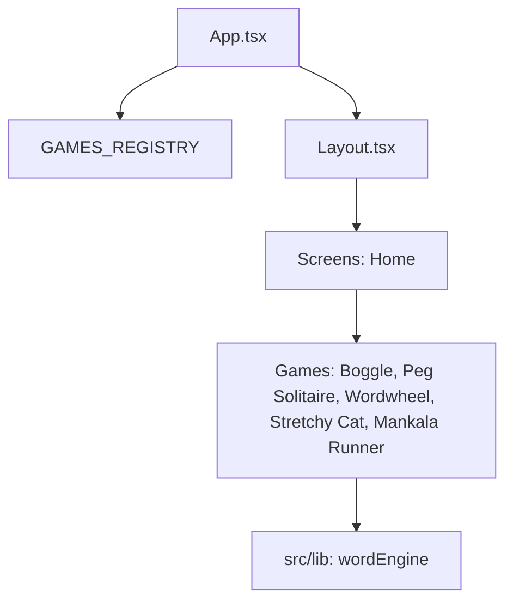

# Architecture Overview: The Mankala Arcade

The Mankala Arcade is a premium, web-based collection of classic board games and puzzles, built with React, Vite, and Tailwind CSS 4.0.

## Project Philosophy
The project aims for a "Physical Heirloom" aesthetic—using dark themes, serif typography, linen textures, and smooth animations to evoke the feeling of a high-end parlor game collection.

## Core Structure

### 1. Registry-Driven Architecture
The heart of the application is the `src/registry/`.
- `games.ts`: Contains metadata (id, title, thumbnail, description) for all games.
- This registry is used to dynamically build the **Home Shelf** and handle routing logic in `App.tsx`.

### 2. Game Pattern
Each game is encapsulated in its own directory under `src/games/`. While implementations vary, they generally follow this convention:
- `UI.tsx`: The primary game board and interactive state.
- `Rules.tsx`: A standard instructions component triggered from the shelf.
- `engine.ts`: Pure logic/state management for the game rules (e.g., move validation, board generation).

### 3. Styling & Design System
- **Tailwind CSS 4.0**: Leverages the latest CSS-in-JS features, including custom variants (e.g., `short` for mobile heights) and CSS variables for theme tokens.
- **Animations**: Powered by `motion` (framer-motion). Custom keyframes for "rainbow-borders" and "spinning-gradients" are defined in `src/index.css`.
- **Theming**: Supports "Midnight Mode" (dark) and "Linen" (light) themes through a global `Layout` state.

### 4. Routing
Uses `react-router-dom` for deep linking.
- `/`: The Home Shelf.
- `/:gameId`: The active game view.
- `/:gameId/rules`: The instructions view for a specific game.

### 5. SEO & Deep Linking
To ensure deep links (e.g., `/word-wheel`) don't 404 on refresh and are indexed by crawlers:
- **`vercel.json`**: Contains rewrites that direct all non-static requests to `index.html`.
- **`public/sitemap.xml`**: Must be updated manually whenever a new game route is added to ensure crawler discovery.
- **`react-helmet-async`**: Used in `App.tsx` to provide unique `<title>`, `<meta>`, and `canonical` tags for every route.

## Key Technologies
- **React 19**: Modern UI framework.
- **Vite 6**: Fast development and build tool.
- **Motion (Framer Motion)**: For tactile, physical-feeling transitions.
- **Three.js & R3F**: For 3D immersive experiences like Mankala Runner.
- **Lucide React**: Minimalist iconography.
- **React Helmet Async**: For SEO and dynamic document titles.
- **Zustand**: For lightweight global state management (Interface Store).

## 6. Immersive Interface System
To maximize screen real-estate during active gameplay, the Arcade uses a centralized visibility system.
- **`interfaceStore.ts`**: A Zustand store tracking `isImmersive`.
- **`useImmersiveMode` hook**: A shared hook used by all games to toggle immersion based on game-specific states (e.g., Playing vs. Game Over).
- **Conditional Layout**: `Layout.tsx` reactively hides the header/nav and locks the browser viewport (to prevent pull-to-refresh jitter) only when the immersive flag is active.
